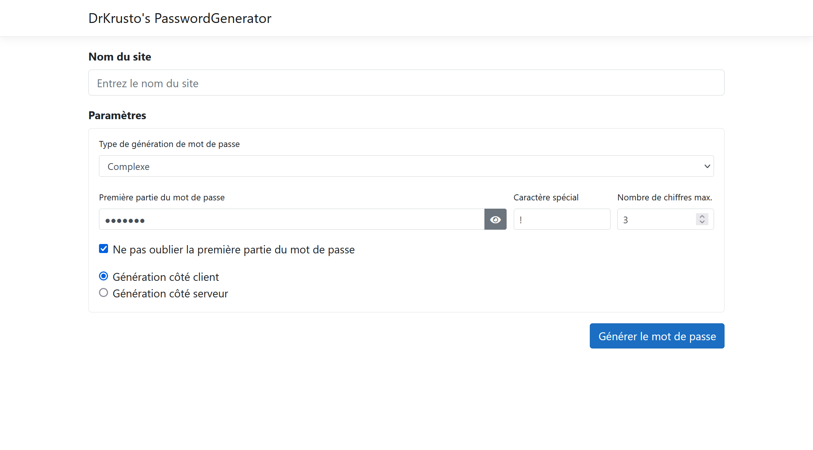

# WebPasswordGenerator

## What is it?
 WebPasswordGenerator simple password generator made with Bootstrap, jQuery and ASP.NET Core which gives you multiple ways to generate your password. This is a port of [another password generator](https://github.com/DrKrusto/PasswordGenerator) made in Forms.

## How does the generation works?
 For now there is only two generation types. A simple one and another more complex one. The generation processes are written in JavaScript, but in the future I plan to also write the code server-side.

* **Simple**: It's the easiest generation process. It is pretty easy to understand, the password is made of the first half of the password, then it takes the first three letters of the website and converts it to numbers (A=1, B=2...) it takes the fourth letter of the website in caps and finally it takes the special char that you want and place it in the end.   *"First half of the password" + "First three letters of website to numbers" + "Fourth letter of website" + "Special character"*
* **Complex**: It's an harder generation process but could still be decoded by a human. The layout is almost the same as the simple one, but the numbers and the upper case letter are selected differently, I won't explain it in details.

## Are there more features coming in the future?
Probably. You can see the things I want to work on/I'm working on/I did in a [Trello I made for this project](https://trello.com/b/DKhO4uYR/webpasswordgenerator). If you don't see any new commit for a while or any activity in the Trello it's very likely I'm <del>slacking</del> doing something else.